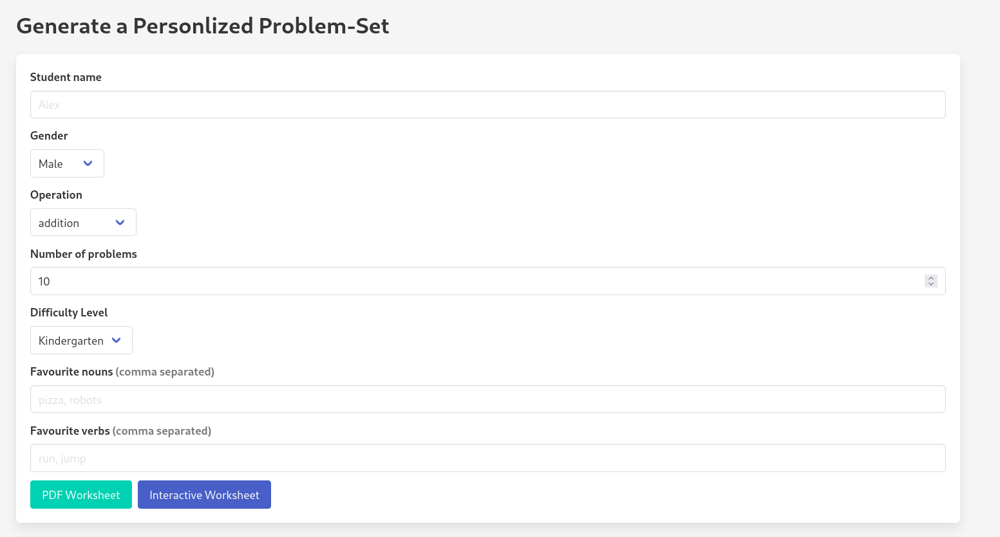

✨ Overview

TinySolvers is a self-hosted app that helps parents and educators create personalized, engaging math word problems for early learners. Powered by the local Gemma 3n language model, it combines structure and creativity to generate themed problem sets with ease—supporting both printable PDFs and interactive worksheets.
🧠 How It Works

    User provides a name, favorite things, and selects difficulty/theme.

    The backend sends a structured prompt to a locally running Gemma 3n model (via Ollama).

    A JSON-formatted set of math word problems is returned, parsed, and stored.

    The user can download a themed PDF worksheet or explore the problems interactively.

🚀 Getting Started
Prerequisites

    Go 1.21+

    Ollama installed and running locally (with gemma3n pulled)

    Chrome installed (used for PDF rendering via chromedp)

Build & Run

go mod tidy
./build.sh
cd ./build/
./tinysolvers

The executable will be named tinysolvers (even though the repo is mathgen_gemma3n).
CLI Options. (Note the `./server/` assets are coppied over to the build directory for front end content)

```
$ ./tinysolvers --help 
Usage of ./tinysolvers:
  -grpc-port string
        gRPC server port (default ":50051")
  -model string
        model name to pass to Ollama (default "gemma3n:e4b")
  -ollama_url string
        base URL of Ollama API (default "http://localhost:11434")
  -out_dir string
        directory to write JSON + PDF results (default "./output")
  -web_port string
        port for Gin web UI (default ":8081")
```
🧩 Features

    📚 JSON-formatted problem sets with name, theme, numbers, operation, and answer

    🧾 Printable PDFs (with emoji and formatting preserved)

    🧠 Context-aware problem generation using Gemma 3n

    ⚡ Fast, single-binary web server using Go + Gin

    🌐 Minimal UI with HTMX and Tailwind for responsive input

    🔒 Local-first architecture: no internet or API keys required

Visit http://localhost:8081 to start using!


🔨 Roadmap

Add custom PDF templates (borders, fonts, themes)

Expand problem generation to include:

    Time-telling

    Graphs

    Algebra (e.g., simple equations, patterns)

SQLite integration to:

    Track number of problems generated by type

    Breakdown PDF vs Interactive usage

Docker Compose stack for:

    Ollama runtime

    Tinysolvers backend

    Frontend server

Add form input validation and mutex-safe Ollama queuing

    Add logo and branding

🤝 Why This Project?

This began as a weekend project by an engineer-dad wanting to make math more engaging for his daughter. What started as a CLI script with templated CSVs quickly grew into a context-rich, LLM-powered app designed to delight kids and support learning.

By making the tool private, local, and highly customizable, TinySolvers is designed to empower caregivers and teachers to deliver meaningful math experiences—without needing to know how to code.