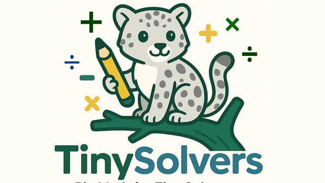

# Tiny Solvers
Big Math for Tiny Solvers



## Introduction


TinySolvers is a self hosted personalized math word problem generator for you or your student. It is designed to help parents or teachers generate customized math word problems for early elementary school students. At its core, the app leverages Gemma3n as a local language model to generate age-appropriate math problems in a structured format. This is then output to either PDF or an interactive webpage for a friendly way to introduce math problems in a structured word format.


## System Architecture
The app consists of the following primary components:


1. Frontend (HTMX + Tailwind CSS)
   A minimal, responsive interface allows users to input themes (e.g., "space", "zoo", "birthday") and difficulty levels. It uses HTMX for low-latency updates, eliminating the need for complex frontend JavaScript frameworks.


2. Backend (Go with Gin)
   A lightweight Go web server handles user requests, manages a queue, and coordinates communication with the language model. It also handles PDF generation and CSV logging of generated problems. The Go server is also responsible for formatting model prompts and parsing responses.


3.  Model Runtime (Gemma 3n via Ollama)
   The language model is run locally using Ollama, which manages the loading and inference of Gemma 3n. Go communicates with Ollama through its HTTP API to stream responses. This allows prompt completion in real-time, with the ability to parse and validate output as it arrives.


4.  Structured Problem Parsing and Storage
   Responses from Gemma 3n are structured as JSON using a defined schema:
```
type Problem struct {
 Index     int
 Theme     string
 Text      string
 Numbers   []int
 Operation string
 Answer    string
}
```
The Go backend stores these to disk in both JSON and CSV format for future review or reloading.


5. PDF and Interactive Sheet Generation
A custom-built PDF generator (using chromedp) creates printable worksheets with problems and answers. An alternate interactive sheet mode is also available for screen-based use.


Use of Gemma 3n


Gemma 3n is the central reasoning engine for the app. Its role is to:


- Generate math problems based on user themes and constraints.


- Follow a structured output format to ensure programmatic parsing.


- Provide creative yet pedagogically sound language suitable for early learners.


To accomplish this, I iteratively engineered prompts for Gemma 3n to output JSON-formatted problems with fields that could be easily validated and displayed. I constrained creativity to themes while enforcing structure and arithmetic clarity.


## Challenges


### Motivation for joining the Kaggle Hackathon:
I am a father as well as an engineer. I originally started this project out of a personal interest, mad-lib style math word problems to make it more engaging. In a weekend I wrote the primary engine very primitively:
1. Maintain a list of CSV math problems with fields like {Name}, {LikedNoun1}, {Number1} {Number2} and {OperationType}.
2. JSON Query where individual inputs their information and it populates the list.
3. Generate PDF.


I didn't even write a front end or anything, just a CLI tool to grok a JSON query.


My real frustration in my design choices became immediate. My daughter likes dinosaurs. The prescribed list in CSV could easily spit out `Jenny has 12 dinosaurs and 4 more dinosaurs show up, how many dinosaurs does she have?` But that is lame when we know about so many different types of dinosaurs! I want someone to put in dinosaurs and know about triceratops or velociraptors! My mind immediately went to [word2vec](https://en.wikipedia.org/wiki/Word2vec), anytime a user submits a query just take the favorite nouns and populate the next 5 like words. Easy. But then the second tough problem hit. If you like dinosaurs, wouldn't you like fossils too? You would need to count the number of fossil bones you found. Something like `Jenny is at an archeological dig site, she finds 5 Tyrannosaurus Rex bones and 13 Brontosaurus bones. How many bones did she find?` Word Problems are fun when they are context related. With all of the rapid innovation with LLMs, they are great at providing longer chain context to minimal inputs, and that got me excited about expanding this tool into a bigger project. It just so happened to coincide with the Kaggle Hackathon Gemma3n Impact Challenge :-). It was also a great time to try and do something new!


My first attempt was to keep the CSV approach:
```csv
id,operation,template
1,addition,"{{.Name}} has {{.Num1}} {{.Noun1}}. After {{.Verb1}}ing, {{.Name}} got {{.Num2}} more {{.Noun1}}. How many {{.Noun1}} does {{.Name}} have now?"
```
This is actually a poor design choice for two reasons:
1. LLMs generating sentences will use `,` commas with no difference in delineation.
2. CSVs are a problem to parse in general.


I ended up aligning the Gemma3n with a system prompt to generate JSON format structures and the results were very promising! There are some format drifting issues to resolve at times but the proof of concept is very sound:
```json
 {
   "index": 2,
   "theme": "Dinosaurs 🦖",
   "text": "Amelia saw 4 friendly Triceratops and 2 long-necked Brachiosaurus. How many dinosaurs did Amelia see altogether?",
   "operation": "addition"
 },
```
That code block leads me to the next realization: kids LOVE characters and emojis! Quickly adding relevant artwork to a word problem makes it very personal and enjoyable vs. abstract text.


Emojis led to another huge challenge as well: PDF Generation.


The go side of the project is pretty straight forward. It's a simple CRUD app with Go, Gin, and generators. Generate a list of problems, then generate a PDF from the list of problems. My first draft of this project was using [go-fpdf](https://github.com/go-pdf/fpdf) for a quick way to generate the PDF based on the structured output from Gemma3n. However, it turns out, PDF generation without an HTML page doesn't support fonts with > 2 colors. So all of the extended unicode emoji pool that LLMs know how to use more easily than I personally do were rendered useless. The chosen path forward was to use the `chromedp` package to generate the HTML version of the page, then render it to PDF in a headless chrome instance, there are plenty of optimizations here required but hey, we got emojis in PDFs :cheer:


## Conclusion
 Conclusion

TinySolvers represents a heartfelt fusion of engineering and parenting—born out of the desire to make math more meaningful and magical for young learners. By blending a Go backend with the power of local language models like Gemma 3n, this project delivers a self-hosted tool that is private, customizable, and playful.

This project was made for me personally, but I hope to be able to share it with others and make it grow more! It also did help shed some light for me on how leveraging AI locally can be a real benefit relative to the standard uses of LLMs these days.

Throughout development, I encountered practical engineering challenges—from handling malformed model outputs and CSV parsing headaches to rendering emoji-rich PDFs. Each hurdle refined the architecture and ultimately led to more robust and joyful results. The shift from static templates to dynamic, theme-aware LLM-driven content has unlocked a new level of engagement and accessibility for math education.

Gemma 3n’s local, low-latency inference capabilities made it the perfect choice for a project that values user control, offline functionality, and creativity rooted in context. The app now reliably generates charming, diverse math problems complete with characters, emojis, and user-specific themes—empowering parents and educators to bring “Big Math” to life for “Tiny Solvers.”


## YouTube link
https://www.youtube.com/watch?v=Rf36frG3_38
